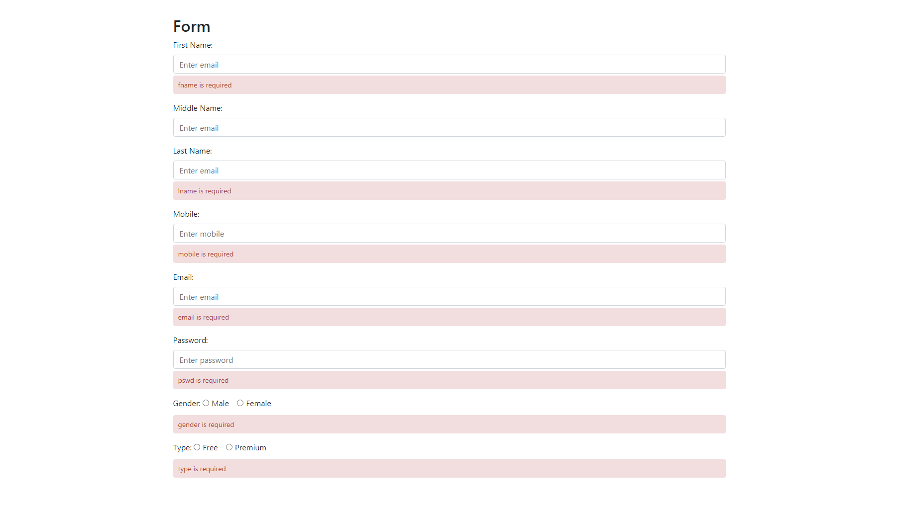

# Form Validation
validation.js helps you to validate form fields dynamically.  If you go through my form.html code, then you will get pattern and validate attribute. Validate should be mentioned in input/select field for required field. Pattern is not mandatory, user can set his/her own pattern.


```
1. validateFormHandler(this) triggers the form validation on form submit
2. inputHandler(this) triggers the validation logic of selected form element on focusout
3. querySelectorAll is being used to get all form fields
4. XMLHttpRequest is used to fetch data from error json API
```

### input text validation
```
<div class="form-group">
      <label for="fname">First Name:</label>
      <input type="text" class="form-control" id="fname" placeholder="Enter firstname" name="fname" onfocusout="inputHandler(this)" pattern="[a-zA-Z]{3,30}" validate>
    </div>
```

### input email validation
```
<div class="form-group">
      <label for="email">Email:</label>
      <input type="email" class="form-control" id="email" placeholder="Enter email" name="email" pattern="[a-zA-Z]+@[a-z]+\.[a-z]{2,4}" onfocusout="inputHandler(this)" validate>
    </div>
```

### input password validation
```
<div class="form-group">
      <label for="pwd">Password:</label>
      <input type="password" class="form-control" id="pwd" placeholder="Enter password" name="pswd" onfocusout="inputHandler(this)" validate>
    </div>
```
### radio validation
```
<div class="form-group">
      <label for="gender">Gender:</label>
      <div class="form-check-inline">
        <label class="form-check-label">
          <input type="radio" class="form-check-input" name="gender" id="male" value="male" onfocusout="inputHandler(this)" >Male
        </label>
      </div>
      <div class="form-check-inline">
        <label class="form-check-label">
          <input type="radio" class="form-check-input" name="gender" id="female" value="female" onfocusout="inputHandler(this)" validate>Female
        </label>
      </div>
    </div>
```

### select box validation
```
<div class="form-group">
      <label for="gender">City:</label>
      <select class="form-control" id="city" name="city" onfocusout="inputHandler(this)" validate>
        <option value="-1">Select</option>
        <option value="0">Kolkata</option>
        <option value="1">Mumbai</option>
        <option value="2">Bangalore</option>
        <option value="3">Delhi</option>
      </select>
    </div>
```

### checkbox validation
```
<div class="form-group form-check">
      <label class="form-check-label">
        <input class="form-check-input" type="checkbox" id="remember" name="remember" onfocusout="inputHandler(this)" validate> Remember me
      </label>
    </div>
```

